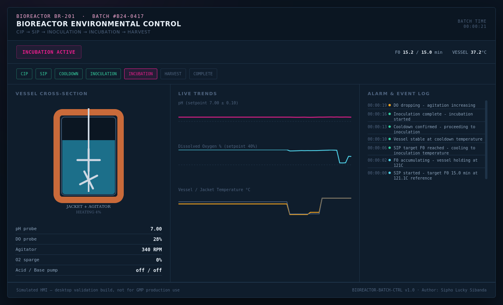
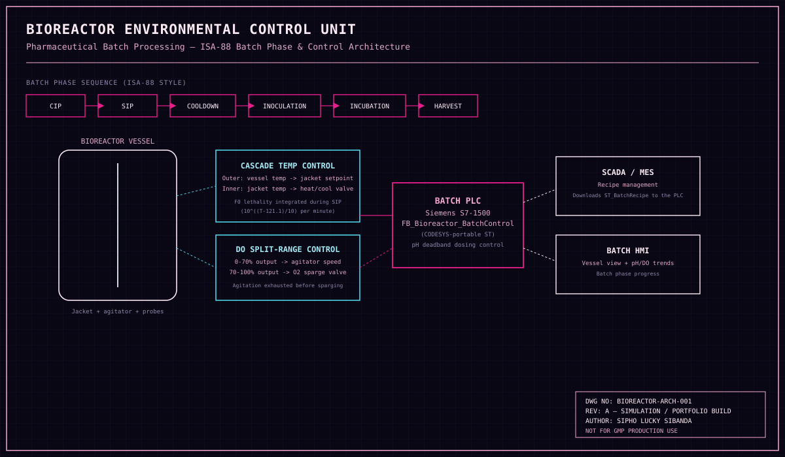

# 🧬 Automated Bioreactor Environmental Control Unit
### for Pharmaceutical Batch Processing


**Author:** Sipho Lucky Sibanda
**Series:** Automation Skills Portfolio — Biotechnology
(a fourth discipline shift — the same PLC engineering discipline applied to a validated pharmaceutical batch process)

---

## 🧬 Context — Why This Matters

Producing a biologic drug substance means holding a living cell culture inside a
precise, validated environment for days — after first proving, beyond reasonable
doubt, that the vessel itself was properly sterilised. This project simulates the
full lifecycle a real biopharma batch record follows: **CIP → SIP (sterilisation) →
Cooldown → Inoculation → Incubation → Harvest**, with the cascade and split-range
control loops that hold temperature, dissolved oxygen, and pH inside spec
throughout.

## 🔧 What This Project Does

`FB_Bioreactor_BatchControl` is a PLC function block (IEC 61131-3 Structured Text) that:

- Sequences a batch through an **ISA-88 style phase state machine**, with a
  recipe structure representing what a real SCADA/MES recipe-management system
  would download to the PLC
- Runs **cascade temperature control**: an outer loop on vessel temperature sets
  the setpoint for an inner loop on jacket temperature, which reacts to
  disturbances far faster than the outer loop alone
- Tracks real **F₀ sterilisation lethality** during SIP — the actual industry
  formula (F₀ = Σ10^((T−121.1)/z)·dt) that makes holding 110°C for an hour
  comparable to 121°C for six minutes, rather than completing SIP on a timer alone
- Controls dissolved oxygen with genuine **split-range logic**: agitation speed
  is exhausted first (fast, cheap), and oxygen sparging only engages once
  agitation is already maxed out
- Doses pH correction with a **deadband**, not a continuous PID, to avoid pump
  chatter on a noisy signal

## 🖥️ HMI — Vessel Cross-Section & Live Trends

The `index.html` mockup shows a bioreactor vessel cross-section with an
animated agitator, a heating/cooling jacket that changes colour with mode, rising
bubbles when oxygen sparging engages, and live scrolling trend charts for pH,
dissolved oxygen, and temperature — exactly the operator view a real batch record
review would reference.



## 🗺️ System Architecture



## ⚙️ Key Engineering Concepts

| Concept | How it's implemented |
|---|---|
| ISA-88 batch phases | An explicit state machine mirroring the real standard structure for batch pharma manufacturing |
| Cascade control | Vessel temperature (outer) sets jacket temperature setpoint (inner) — two PID loops, not one |
| F0 lethality | The real sterilisation-validation formula, not a fixed sterilisation timer |
| Split-range DO control | Agitation authority exhausted before oxygen sparging ever engages |
| Honest failure tracking | An aborted, under-sterilised batch is explicitly flagged — never silently treated as complete |

## 📁 Repository Structure

```
bioreactor-batch-control/
├── README.md
├── src/
│   └── Bioreactor_BatchControl.st    # IEC 61131-3 Structured Text batch logic
├── docs/
│   ├── IO_List.md                    # Full I/O list, recipe parameters
│   └── Testing_Procedures.md         # FAT-style functional test cases
├── hmi/
│   └── index.html                    # Vessel cross-section + live trend charts
└── images/
    ├── architecture_diagram.svg      # Batch phase & control architecture diagram
    └── hmi-dashboard.png             # Rendered HMI screenshot
```

## 📄 Documentation

- [I/O List &amp; Recipe Parameters](IO_List.md)
- [Functional Test Procedures](Testing_Procedures.md)
- [Full Technical Manual (PDF)](Bioreactor_Technical_Manual.pdf) — 25-page project ebook covering GMP/ISA-88 industry context, architecture, hardware, the cascade/split-range/F0 control philosophy, full annotated code, HMI design, alarm philosophy, testing/commissioning, and a HAZOP-style hazard register

## ⚠️ Disclaimer

This is a **simulation and portfolio project**. It is not validated, has not been
tested against real hardware, and must not be used as a basis for an actual GMP
pharmaceutical manufacturing system. A real installation requires full process
validation, 21 CFR Part 11 compliant data integrity, and qualification against the
specific cell line and product involved.

## 👤 Author

**Sipho Lucky Sibanda**
Automation & Controls Portfolio — Marine, Avionics, Architectural, Applied AI, Biotech &amp; Industrial Systems

---
